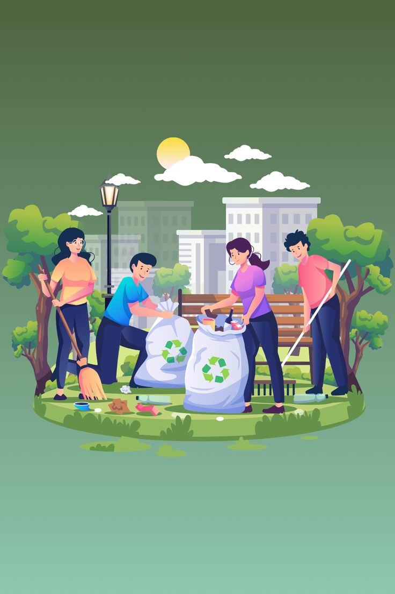

# ♻️ EcoTrack — Community Recycling Tracker

> A gamified full-stack web platform that connects residents with recycling collectors across Sri Lanka's districts. Residents post recyclable items, collectors claim and pick them up, and everyone tracks their environmental impact through points, levels, and badges.



🔗 **Live Demo:** _coming soon_  
🎥 **Demo Video:** _coming soon_  
📁 **GitHub:** [github.com/Amandi1020/community-recycling-tracker](https://github.com/Amandi1020/community-recycling-tracker)

---

## 📌 Overview

EcoTrack solves a real community problem — making recycling easy, rewarding, and trackable. Instead of recyclables going to waste, residents list items they want to give away, and collectors in the same district browse and claim them. Every successful collection earns the resident points, contributing to their level, badges, and the district leaderboard.

This project was built as a portfolio piece applying **Management Information Systems** concepts — role-based access control, data-driven decision making, gamification systems, and real-world workflows — in a deployable full-stack application.

---

## ✨ Features

### 🏠 Resident
- Register and post recyclable items with photos
- Visual category picker with icons (Plastic, Paper, E-Waste, Glass, Metal)
- Track listing status in real time — available → claimed → collected
- Personal impact dashboard — points, level, CO₂ saved, monthly donut chart
- Earn achievement badges for recycling milestones
- District leaderboard with podium for top 3 recyclers

### 🚛 Collector
- Browse available items filtered by district and category
- Claim items for pickup with one click
- Mark items as collected to trigger resident point awards
- Collection history with stats — total collections, kg collected, pending pickups

### ⚙️ Admin
- System-wide analytics — bar chart (listings by district), pie chart (items by category), line chart (monthly trend)
- Approve, deactivate or delete user accounts with search and dual role/status filters
- Dedicated collector approval workflow — pending → approved → active
- Edit category point values and CO₂ coefficients in real time
- District breakdown table with recycling stats per area

### 🎮 Gamification
- Points awarded automatically per kg based on recyclable category
- **4 levels:** Seedling 🌱 → Sprout 🌿 → Guardian 🌳 → Eco Hero 🏆
- **Achievement badges:** First Drop, E-Waste Warrior, 100kg Club, Eco Hero
- CO₂ saved calculator (auto-calculated from weight × category coefficient)
- District leaderboard showing rankings, levels and kg recycled

---

## 🛠️ Tech Stack

| Layer | Technology |
|---|---|
| Frontend | React 18 (Vite), Tailwind CSS v4, React Router, Recharts, Axios |
| Backend | Node.js, Express.js |
| Database | MySQL |
| Authentication | JWT (JSON Web Tokens), bcrypt |
| File Uploads | Multer |
| Fonts | Fraunces (display), Inter (body) |

---

## 🗂️ Project Structure

```
community-recycling-tracker/
├── client/                          # React frontend (Vite)
│   └── src/
│       ├── assets/
│       │   ├── illustrations/       # Page hero images
│       │   └── icons/               # Category & badge icons
│       ├── components/
│       │   ├── Navbar.jsx
│       │   └── PrivateRoute.jsx
│       ├── context/
│       │   └── AuthContext.jsx
│       ├── pages/
│       │   ├── auth/                # Login, Register
│       │   ├── resident/            # Dashboard, PostItem, MyListings, Leaderboard
│       │   ├── collector/           # Dashboard, BrowseItems, History
│       │   └── admin/               # Dashboard, Users, Collectors, Categories
│       └── utils/
│           └── axios.js
├── server/                          # Node.js backend
│   ├── config/
│   │   ├── db.js
│   │   └── schema.sql
│   ├── controllers/
│   │   ├── authController.js
│   │   ├── residentController.js
│   │   ├── collectorController.js
│   │   └── adminController.js
│   ├── middleware/
│   │   └── auth.js
│   ├── routes/
│   │   ├── authRoutes.js
│   │   ├── residentRoutes.js
│   │   ├── collectorRoutes.js
│   │   └── adminRoutes.js
│   └── uploads/
└── README.md
```

---

## ⚙️ Setup & Installation

### Prerequisites
- Node.js v18+
- MySQL 8+
- Git

### 1. Clone the repository
```bash
git clone https://github.com/Amandi1020/community-recycling-tracker.git
cd community-recycling-tracker
```

### 2. Backend setup
```bash
cd server
npm install
```

Create a `.env` file inside `server/`:
```env
PORT=5000
DB_HOST=localhost
DB_USER=root
DB_PASSWORD=your_mysql_password
DB_NAME=recycling_tracker
JWT_SECRET=your_secret_key
```

Create the database and run the schema:
```sql
CREATE DATABASE recycling_tracker;
```
Then run `server/config/schema.sql` in MySQL Workbench.

Start the backend:
```bash
npm run dev
```
Backend runs at `http://localhost:5000`

### 3. Frontend setup
```bash
cd client
npm install
npm run dev
```
Frontend runs at `http://localhost:5173`

### 4. Create admin account
Run this in MySQL Workbench after setup:
```sql
USE recycling_tracker;
INSERT INTO users (name, email, password_hash, role, district, status)
VALUES ('Admin', 'admin@ecotrack.com', '<bcrypt_hash>', 'admin', 'Colombo', 'active');
```
Or use the `createAdmin.js` utility script in the server folder.

---

## 🗄️ Database Schema

6 core tables supporting the full platform:

| Table | Purpose |
|---|---|
| `users` | Residents, collectors and admins with role, district, points, level and status |
| `categories` | Recyclable types with points_per_kg and co2_per_kg coefficients |
| `listings` | Items posted by residents with status tracking |
| `claims` | Collector pickup records linking listings to collectors |
| `badges` | Achievement definitions with unlock conditions |
| `user_badges` | Junction table tracking which users have earned which badges |

---

## 🌍 District System

EcoTrack operates at **district level** across all 25 Sri Lanka districts. Users select their district at registration, and all listings, collectors, and leaderboards are automatically scoped to that district. This makes the platform practical for real community use — a collector in Kandy only sees items from Kandy residents.

---

## 🎯 CO₂ Calculation

Each category stores a `co2_per_kg` coefficient based on real-world carbon offset data:

| Category | Points/kg | CO₂ saved/kg |
|---|---|---|
| Plastic | 10 | 1.5 kg |
| Paper | 5 | 0.9 kg |
| E-Waste | 20 | 2.0 kg |
| Glass | 8 | 0.7 kg |
| Metal | 15 | 1.8 kg |

When a collector marks an item as collected: `co2_saved = weight_kg × co2_per_kg`. The resident's CO₂ counter updates automatically on their dashboard.

---

## 🔐 User Roles & Access

| Role | Registration | Access |
|---|---|---|
| Resident | Self-register | Post items, dashboard, leaderboard |
| Collector | Self-register (requires admin approval) | Browse items, claim, history |
| Admin | Created directly in database | Full system management |

---

## 🚀 Future Improvements

- Live deployment (Vercel + Railway)
- Collector service radius selection (beyond district-level)
- In-app notifications for claimed items
- Resident-to-collector ratings and reviews
- PDF monthly impact report export
- SMS/email notifications via Twilio or EmailJS
- Mobile app version (React Native)
- Map view for listing locations

---

## 📸 Screenshots

_Coming soon — demo video and screenshots will be added after deployment._

---

## 👩‍💻 About

Built by **Amandi** — 2nd Year MIS Undergraduate  
This project was built to demonstrate full-stack development skills, MIS concepts, and real-world system design for internship applications.

[](https://github.com/Amandi1020)

---

## 📄 License

This project is open source and available for educational purposes.